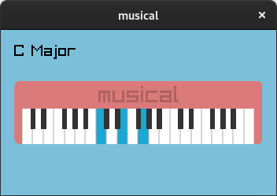

about
-----

A graphical program made with [raylib](https://www.raylib.com) to find
the names of chords played on the piano keyboard. It is possible to use
the keyboard or the mouse as input. The config.h file has all the
[keybindings](config.h#L13-L46) in an array.

how to run this program?
------------------------

You need to [install
raylib](https://github.com/raysan5/raylib/blob/master/README.md#build-and-installation),
[make](https://en.wikipedia.org/wiki/Make_(software)), and a [C99
compatible compiler](https://en.wikipedia.org/wiki/C99#Implementations)
like [GCC](https://gcc.gnu.org). Configure the Makefile as needed and
then compile with `make` command inside the repository.
