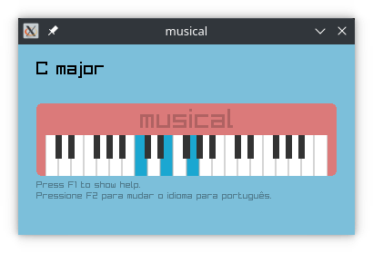

[1]: https://www.raylib.com
[2]: https://github.com/raysan5/raylib/blob/master/README.md#build-and-installation
[3]: https://en.wikipedia.org/wiki/Make_(software)
[4]: https://en.wikipedia.org/wiki/C99#Implementations
[5]: https://gcc.gnu.org

about
-----

A graphical program made with [raylib][1] to see the chords, intervals
and their names being played on the piano keyboard. It is possible to
use the keyboard or the mouse as input. The config.h file has all the
[keybindings](src/config.h#L13-L50) in an array.

how to run this program?
------------------------

You need to [install raylib][2], [make][3], and a [C99 compatible
compiler][4] like [GCC][5]. Configure the Makefile as needed and then
compile with `make` command inside the repository.
